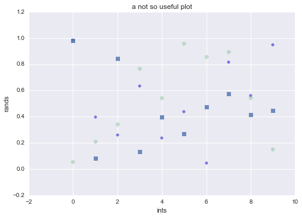
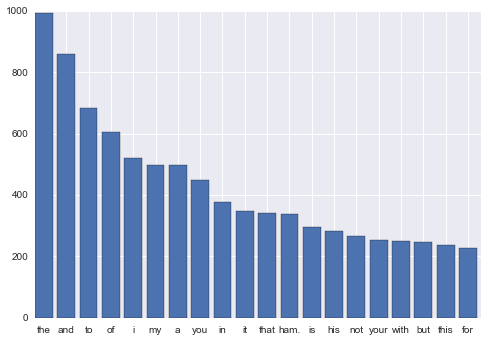

# Python and Friends

%matplotlib inline
import numpy as np
import matplotlib.pyplot as plt
import pandas as pd
import seaborn as sns
pd.set_option('display.width', 500)
pd.set_option('display.max_columns', 100)

##The Notebook

Look up http:/www.google.com Lets eat a burrito. $\alpha = \frac{\beta}{\gamma}$

1. an item
2. another item
3. i like items

##The Python Language

    1+2

    3

    1/2,1.0/2.0,3*3.2

    (0, 0.5, 9.600000000000001)

    print 1+3.0,"\n",5/3.0
    5/3

    4.0 
    1.66666666667

    1

## Python and Iteration

In working with python I always remember: a python is a duck.

What I mean is, python has a certain way of doing things. For example lets call
one of these ways listiness. Listiness works on lists, dictionaries, files, and
a general notion of something called an iterator.

But first, lets introduce the notion of a comprehension. Its a way of
constructing a list

    alist=[1,2,3,4,5]
    asquaredlist=[i*i for i in alist]
    asquaredlist

    [1, 4, 9, 16, 25]

Python has some nifty functions like `enumerate` and `zip`. The first is a duck,
but the second isnt.

    enumerate(asquaredlist),zip(alist, asquaredlist)

    (<enumerate at 0x10977be10>, [(1, 1), (2, 4), (3, 9), (4, 16), (5, 25)])

Someone realized that design flaw and created izip.

    from itertools import izip
    izip(alist, asquaredlist)

    <itertools.izip at 0x1079c4e18>

    print enumerate(asquaredlist)

    <enumerate object at 0x10a040f00>

    [k for k in enumerate(asquaredlist)]

    [(0, 1), (1, 4), (2, 9), (3, 16), (4, 25)]

Open files behave like lists too!

    linelengths=[len(line) for line in open("hamlet.txt")]
    print linelengths

    [24, 2, 29, 2, 45, 2, 26, 39, 12, 2, 28, 2, 20, 11, 2, 50, 2, 59, 2, 59, 25, 2, 36, 30, 2, 54, 56, 30, 2, 52, 31, 2, 35, 2, 30, 2, 57, 52, 2, 12, 2, 23, 2, 37, 23, 2, 49, 2, 56, 2, 30, 2, 47, 43, 49, 38, 46, 38, 43, 2, 40, 2, 28, 44, 42, 31, 2, 29, 42, 2, 29, 53, 51, 46, 27, 2, 32, 18, 2, 29, 2, 56, 2, 51, 2, 56, 2, 55, 31, 2, 29, 2, 57, 44, 41, 53, 2, 24, 2, 31, 2, 54, 2, 17, 2, 39, 2, 52, 43, 23, 48, 38, 19, 2, 34, 34, 37, 38, 44, 40, 14, 2, 57, 49, 2, 57, 44, 49, 2, 54, 48, 44, 42, 45, 53, 44, 45, 50, 31, 20, 46, 42, 44, 46, 53, 53, 52, 38, 50, 45, 38, 43, 35, 48, 38, 48, 37, 48, 43, 40, 46, 43, 37, 47, 45, 42, 51, 44, 21, 2, 47, 51, 42, 54, 57, 41, 50, 41, 42, 55, 51, 2, 48, 33, 2, 21, 2, 20, 2, 20, 2, 13, 2, 38, 35, 38, 41, 2, 54, 2, 50, 40, 43, 49, 43, 45, 42, 43, 36, 2, 47, 49, 43, 45, 49, 50, 51, 42, 2, 53, 45, 48, 42, 43, 37, 46, 47, 45, 49, 45, 2, 9, 2, 16, 2, 63, 11, 51, 2, 55, 47, 55, 38, 50, 43, 42, 49, 49, 42, 44, 53, 43, 43, 47, 47, 47, 41, 47, 45, 46, 47, 40, 43, 47, 32, 2, 49, 48, 39, 42, 44, 47, 46, 43, 40, 45, 42, 49, 34, 47, 2, 57, 2, 50, 2, 31, 2, 45, 47, 42, 55, 45, 43, 43, 47, 34, 24, 45, 50, 37, 42, 52, 48, 2, 39, 23, 25, 39, 2, 55, 43, 40, 53, 2, 55, 48, 2, 52, 52, 38, 41, 52, 37, 2, 31, 2, 21, 39, 2, 54, 45, 41, 41, 41, 41, 52, 47, 45, 45, 49, 2, 37, 24, 47, 47, 52, 39, 42, 39, 48, 44, 41, 42, 45, 40, 41, 48, 46, 44, 48, 50, 45, 41, 46, 43, 37, 50, 42, 42, 38, 41, 45, 44, 2, 52, 46, 2, 32, 16, 2, 48, 42, 43, 45, 48, 48, 55, 40, 2, 9, 2, 15, 2, 54, 40, 38, 51, 42, 42, 48, 56, 51, 49, 39, 47, 48, 46, 45, 39, 44, 53, 47, 47, 44, 51, 53, 49, 38, 45, 43, 43, 43, 40, 49, 41, 2, 31, 2, 36, 34, 2, 27, 29, 2, 29, 32, 44, 11, 2, 22, 2, 51, 46, 43, 2, 45, 44, 40, 47, 39, 49, 2, 54, 2, 54, 43, 2, 47, 2, 56, 47, 43, 40, 39, 2, 27, 34, 45, 2, 48, 39, 2, 49, 2, 19, 38, 2, 29, 43, 41, 39, 21, 2, 39, 2, 50, 41, 42, 51, 40, 47, 49, 44, 52, 40, 47, 40, 49, 42, 51, 43, 31, 2, 29, 51, 2, 35, 24, 47, 40, 46, 45, 43, 28, 2, 26, 2, 50, 45, 23, 2, 52, 30, 24, 2, 25, 24, 2, 26, 37, 2, 36, 46, 2, 36, 51, 2, 23, 22, 2, 37, 24, 2, 35, 2, 39, 2, 46, 58, 2, 24, 2, 26, 2, 34, 2, 49, 18, 2, 58, 2, 31, 2, 47, 52, 43, 43, 42, 40, 41, 45, 45, 15, 2, 34, 2, 8, 2, 46, 46, 53, 54, 50, 8, 2, 2, 14, 2, 2, 28, 2, 48, 40, 42, 27, 2, 31, 54, 40, 40, 43, 37, 2, 26, 2, 29, 42, 47, 43, 48, 44, 45, 51, 43, 40, 48, 45, 48, 43, 56, 47, 38, 48, 48, 50, 46, 49, 31, 45, 47, 39, 40, 41, 49, 45, 42, 43, 42, 42, 50, 2, 56, 46, 41, 46, 44, 50, 30, 2, 28, 17, 2, 44, 38, 37, 2, 56, 47, 52, 39, 50, 42, 44, 50, 51, 48, 46, 41, 45, 47, 52, 40, 46, 42, 51, 50, 38, 46, 43, 46, 43, 42, 43, 2, 51, 2, 57, 2, 46, 25, 2, 34, 46, 2, 20, 2, 12, 2, 48, 61, 2, 34, 38, 47, 54, 35, 46, 48, 45, 45, 52, 24, 2, 59, 42, 48, 54, 2, 58, 46, 56, 48, 42, 2, 52, 23, 2, 54, 2, 52, 39, 2, 54, 48, 49, 48, 43, 53, 46, 41, 44, 43, 40, 41, 51, 47, 40, 44, 41, 55, 41, 49, 44, 2, 32, 2, 9, 2, 35, 2, 50, 42, 2, 25, 36, 2, 27, 2, 65, 44, 31, 58, 52, 49, 43, 27, 2, 28, 21, 43, 42, 51, 14, 2, 32, 2, 50, 47, 57, 37, 42, 51, 47, 41, 43, 46, 38, 43, 46, 50, 42, 48, 39, 51, 50, 2, 23, 2, 44, 37, 14, 2, 42, 40, 25, 2, 26, 2, 51, 2, 25, 2, 40, 38, 44, 38, 41, 2, 56, 43, 42, 46, 49, 42, 51, 2, 35, 2, 28, 2, 37, 2, 28, 43, 37, 40, 50, 38, 2, 25, 2, 44, 2, 53, 2, 51, 53, 2, 31, 2, 32, 2, 9, 2, 25, 2, 58, 2, 18, 2, 16, 2, 34, 44, 25, 2, 26, 2, 52, 24, 2, 37, 2, 55, 2, 15, 33, 49, 44, 50, 49, 41, 44, 52, 59, 41, 44, 44, 38, 52, 42, 2, 20, 54, 2, 18, 52, 46, 2, 35, 26, 41, 26, 2, 29, 49, 46, 53, 48, 52, 37, 43, 46, 23, 2, 45, 51, 54, 47, 42, 46, 42, 42, 46, 43, 48, 57, 49, 45, 60, 48, 49, 39, 38, 42, 44, 40, 41, 48, 44, 42, 44, 46, 40, 49, 21, 43, 51, 44, 37, 43, 39, 41, 43, 39, 39, 39, 48, 48, 48, 50, 47, 41, 34, 8, 2, 55, 49, 44, 42, 49, 42, 35, 42, 53, 43, 42, 43, 47, 27, 49, 50, 50, 45, 42, 48, 2, 42, 30, 2, 20, 2, 27, 2, 18, 2, 31, 2, 45, 2, 32, 29, 23, 29, 2, 29, 2, 35, 2, 24, 2, 61, 22, 31, 2, 58, 27, 2, 53, 24, 2, 41, 43, 46, 51, 42, 46, 25, 2, 55, 2, 45, 21, 2, 36, 2, 55, 51, 46, 46, 48, 45, 27, 2, 36, 2, 54, 2, 31, 2, 26, 2, 32, 2, 33, 2, 23, 2, 44, 2, 39, 2, 17, 2, 30, 2, 61, 49, 19, 2, 34, 2, 54, 20, 2, 16, 2, 52, 24, 42, 46, 20, 2, 16, 2, 64, 48, 2, 56, 2, 54, 53, 50, 43, 46, 46, 36, 46, 49, 45, 48, 58, 39, 45, 50, 8, 2, 18, 2, 52, 43, 39, 52, 54, 47, 45, 40, 31, 2, 9, 2, 2, 17, 2, 31, 2, 55, 2, 27, 2, 56, 40, 18, 2, 37, 2, 29, 32, 46, 54, 44, 47, 51, 45, 51, 45, 47, 32, 2, 54, 43, 42, 50, 42, 47, 41, 22, 2, 30, 2, 46, 44, 2, 45, 2, 57, 43, 36, 59, 44, 44, 54, 2, 29, 2, 42, 40, 2, 40, 41, 47, 50, 56, 47, 44, 41, 43, 43, 20, 2, 30, 2, 38, 35, 46, 41, 33, 2, 50, 48, 37, 54, 50, 44, 40, 50, 50, 42, 44, 39, 36, 48, 26, 2, 38, 2, 25, 2, 49, 2, 28, 2, 40, 2, 27, 8, 2, 16, 2, 20, 37, 50, 2, 45, 49, 44, 45, 43, 51, 41, 39, 42, 2, 29, 58, 2, 25, 53, 45, 45, 38, 40, 41, 47, 45, 45, 47, 46, 46, 45, 43, 2, 51, 35, 43, 47, 37, 45, 49, 50, 39, 19, 2, 33, 50, 50, 53, 39, 44, 37, 47, 50, 47, 2, 9, 2, 2, 16, 2, 62, 2, 54, 45, 43, 46, 42, 44, 43, 53, 45, 40, 51, 52, 49, 40, 44, 43, 37, 2, 52, 46, 48, 44, 41, 40, 44, 29, 2, 31, 47, 45, 19, 2, 24, 48, 43, 17, 2, 56, 2, 54, 38, 28, 16, 41, 2, 54, 31, 8, 2, 17, 17, 2, 51, 23, 2, 55, 2, 53, 38, 42, 46, 42, 41, 35, 2, 53, 2, 51, 49, 2, 57, 48, 50, 2, 47, 49, 43, 2, 55, 46, 55, 42, 44, 41, 40, 49, 43, 46, 45, 43, 40, 51, 40, 50, 45, 42, 42, 46, 45, 42, 26, 2, 28, 45, 41, 55, 49, 20, 2, 14, 2, 43, 37, 41, 49, 49, 48, 54, 44, 45, 44, 17, 2, 36, 2, 46, 51, 42, 41, 45, 45, 42, 44, 52, 47, 40, 46, 2, 13, 2, 69, 61, 58, 15, 2, 37, 2, 54, 35, 34, 27, 26, 63, 67, 12, 45, 28, 47, 37, 49, 24, 2, 46, 34, 47, 2, 58, 45, 41, 43, 48, 42, 46, 44, 51, 43, 44, 50, 50, 41, 49, 40, 41, 45, 48, 41, 22, 2, 35, 29, 2, 59, 40, 27, 25, 2, 52, 41, 48, 19, 2, 37, 27, 40, 14, 2, 26, 2, 54, 37, 42, 43, 37, 31, 2, 26, 34, 2, 46, 15, 2, 43, 26, 2, 20, 2, 49, 26, 2, 34, 54, 2, 23, 2, 47, 2, 26, 58, 36, 2, 35, 2, 54, 31, 22, 23, 2, 54, 57, 13, 2, 60, 58, 54, 58, 49, 28, 2, 38, 22, 46, 2, 60, 63, 47, 54, 53, 55, 54, 60, 13, 2, 34, 42, 26, 23, 39, 43, 15, 30, 36, 34, 19, 46, 32, 40, 22, 2, 55, 54, 6, 2, 33, 2, 34, 2, 50, 9, 36, 2, 27, 2, 31, 30, 50, 54, 7, 51, 2, 61, 33, 2, 37, 26, 2, 57, 16, 33, 2, 56, 38, 52, 8, 2, 52, 57, 56, 38, 26, 27, 2, 33, 2, 57, 47, 7, 2, 36, 2, 57, 59, 10, 2, 53, 27, 2, 54, 59, 20, 2, 53, 56, 13, 2, 43, 2, 54, 51, 2, 55, 47, 57, 29, 2, 54, 58, 55, 48, 50, 2, 55, 52, 57, 53, 46, 2, 38, 52, 59, 54, 49, 2, 32, 52, 59, 58, 56, 54, 21, 2, 25, 54, 14, 2, 36, 2, 55, 57, 57, 65, 54, 59, 50, 59, 59, 61, 46, 54, 59, 52, 56, 53, 53, 11, 2, 51, 10, 2, 54, 9, 57, 53, 54, 35, 2, 55, 52, 55, 57, 54, 58, 60, 11, 54, 28, 2, 55, 47, 7, 2, 57, 25, 51, 47, 34, 2, 44, 52, 53, 50, 55, 54, 55, 43, 2, 52, 56, 57, 54, 63, 51, 17, 2, 59, 66, 50, 51, 14, 2, 24, 53, 9, 2, 37, 58, 2, 55, 50, 55, 64, 50, 15, 2, 27, 2, 31, 2, 54, 54, 52, 59, 57, 52, 30, 2, 33, 49, 52, 17, 2, 35, 2, 56, 58, 28, 2, 58, 40, 2, 55, 59, 17, 2, 43, 2, 44, 32, 43, 2, 22, 2, 25, 2, 42, 61, 31, 45, 66, 28, 52, 60, 15, 2, 58, 7, 41, 45, 33, 2, 30, 2, 42, 59, 26, 2, 31, 2, 40, 54, 59, 53, 20, 30, 2, 54, 53, 59, 55, 50, 57, 58, 59, 62, 62, 27, 2, 34, 56, 59, 57, 59, 57, 57, 57, 63, 52, 59, 58, 59, 58, 60, 58, 42, 47, 43, 51, 43, 45, 52, 47, 41, 53, 42, 48, 29, 2, 59, 21, 2, 34, 51, 46, 39, 48, 50, 51, 45, 47, 49, 40, 49, 39, 58, 42, 50, 49, 46, 47, 42, 40, 48, 48, 22, 48, 40, 52, 52, 25, 2, 26, 2, 58, 55, 33, 2, 55, 2, 29, 44, 2, 40, 22, 46, 45, 44, 45, 52, 56, 46, 43, 48, 44, 47, 52, 25, 2, 56, 41, 2, 55, 61, 50, 56, 54, 34, 2, 60, 2, 51, 54, 55, 55, 4, 2, 20, 2, 13, 2, 58, 49, 21, 19, 2, 53, 60, 51, 19, 2, 52, 56, 31, 24, 2, 9, 2, 15, 2, 42, 40, 45, 42, 48, 47, 46, 48, 51, 13, 40, 50, 43, 53, 50, 42, 42, 44, 40, 46, 42, 43, 43, 51, 49, 57, 45, 45, 41, 41, 43, 52, 58, 15, 53, 43, 45, 50, 38, 47, 56, 41, 46, 42, 52, 53, 46, 44, 46, 48, 45, 45, 42, 41, 41, 48, 47, 2, 6, 2, 53, 19, 8, 2, 49, 45, 43, 37, 2, 59, 49, 2, 53, 43, 47, 19, 2, 33, 32, 2, 52, 2, 51, 24, 2, 42, 55, 50, 43, 43, 43, 31, 2, 25, 48, 30, 2, 57, 43, 51, 19, 2, 29, 2, 9, 2, 38, 45, 43, 60, 48, 43, 38, 44, 26, 2, 26, 38, 44, 53, 42, 21, 2, 31, 2, 57, 49, 42, 49, 51, 36, 21, 2, 24, 55, 50, 47, 44, 20, 53, 2, 9, 2, 15, 2, 51, 44, 47, 45, 45, 41, 50, 46, 42, 53, 53, 48, 41, 38, 52, 49, 47, 42, 43, 41, 51, 40, 46, 45, 41, 48, 42, 46, 39, 50, 43, 45, 45, 42, 28, 2, 24, 42, 46, 2, 49, 40, 30, 2, 40, 2, 54, 50, 50, 43, 50, 15, 2, 33, 17, 2, 24, 36, 54, 43, 2, 53, 21, 56, 55, 61, 56, 29, 2, 49, 2, 53, 60, 24, 2, 34, 2, 51, 60, 63, 59, 44, 58, 55, 55, 55, 42, 26, 2, 54, 54, 2, 41, 2, 56, 59, 55, 58, 50, 57, 2, 41, 2, 56, 62, 51, 60, 48, 55, 62, 32, 2, 14, 2, 53, 57, 46, 48, 52, 44, 45, 49, 49, 51, 37, 49, 27, 2, 52, 53, 56, 43, 44, 39, 32, 51, 42, 40, 37, 44, 50, 49, 47, 44, 46, 48, 45, 40, 45, 49, 46, 48, 43, 33, 2, 26, 48, 2, 9, 2, 48, 2, 54, 58, 58, 54, 63, 45, 55, 57, 60, 56, 54, 58, 55, 37, 2, 33, 2, 52, 56, 56, 55, 61, 61, 51, 55, 54, 62, 50, 58, 50, 59, 58, 61, 55, 52, 63, 2, 58, 9, 2, 53, 57, 57, 56, 56, 59, 57, 25, 2, 15, 2, 49, 2, 18, 42, 47, 2, 36, 2, 16, 2, 36, 26, 2, 9, 2, 16, 2, 27, 43, 2, 46, 39, 2, 26, 2, 39, 44, 45, 57, 48, 46, 51, 48, 44, 52, 48, 42, 54, 51, 47, 50, 50, 45, 43, 46, 47, 46, 47, 41, 44, 42, 42, 34, 44, 41, 46, 27, 2, 24, 54, 44, 53, 20, 63, 14, 13, 2, 54, 17, 2, 38, 56, 53, 2, 56, 20, 2, 51, 28, 55, 7, 2, 33, 63, 18, 2, 60, 36, 50, 2, 46, 2, 54, 2, 35, 40, 20, 2, 41, 19, 2, 48, 35, 2, 58, 26, 16, 2, 35, 15, 19, 2, 53, 56, 51, 8, 2, 47, 2, 55, 61, 50, 58, 57, 56, 53, 2, 38, 2, 62, 10, 64, 9, 63, 13, 62, 15, 62, 12, 61, 13, 65, 11, 65, 13, 63, 13, 7, 2, 9, 2, 36, 51, 11, 2, 55, 7, 53, 40, 2, 50, 52, 58, 8, 2, 56, 7, 17, 2, 31, 35, 34, 2, 54, 29, 2, 25, 28, 2, 57, 46, 48, 51, 48, 39, 2, 50, 46, 42, 51, 45, 43, 45, 36, 49, 41, 2, 57, 45, 50, 45, 25, 30, 47, 39, 47, 2, 28, 2, 51, 48, 40, 38, 2, 54, 42, 38, 40, 51, 42, 37, 48, 43, 44, 38, 47, 49, 48, 49, 54, 43, 50, 54, 47, 41, 47, 43, 34, 36, 42, 41, 53, 44, 51, 2, 54, 47, 45, 46, 50, 34, 2, 37, 2, 31, 32, 49, 29, 2, 33, 2, 9, 2, 46, 2, 6, 2, 39, 44, 2, 38, 2, 59, 7, 61, 13, 2, 37, 47, 60, 53, 55, 58, 60, 17, 2, 41, 2, 41, 2, 55, 37, 2, 47, 2, 54, 6, 2, 33, 2, 34, 52, 57, 2, 40, 33, 47, 50, 51, 43, 39, 2, 33, 2, 54, 56, 56, 24, 2, 25, 2, 40, 2, 27, 27, 2, 35, 2, 33, 2, 9, 2, 25, 2, 45, 25, 46, 27, 63, 55, 57, 16, 2, 23, 2, 24, 37, 46, 24, 23, 2, 31, 2, 55, 36, 28, 2, 42, 36, 38, 2, 52, 39, 41, 19, 2, 54, 2, 30, 2, 25, 2, 29, 55, 2, 26, 42, 2, 57, 55, 56, 14, 2, 53, 49, 2, 34, 2, 60, 32, 2, 25, 2, 55, 63, 47, 58, 14, 2, 23, 2, 26, 55, 56, 48, 38, 2, 58, 36, 2, 53, 63, 13, 57, 19, 2, 55, 37, 40, 2, 54, 2, 58, 54, 41, 2, 33, 2, 55, 53, 56, 18, 28, 2, 55, 56, 30, 54, 19, 2, 54, 17, 28, 2, 20, 2, 32, 2, 26, 2, 42, 2, 56, 55, 54, 34, 2, 55, 34, 2, 49, 52, 55, 52, 61, 52, 57, 58, 54, 17, 17, 2, 52, 15, 2, 55, 15, 2, 55, 2, 41, 2, 39, 2, 26, 29, 2, 51, 38, 23, 2, 26, 8, 2, 53, 44, 55, 55, 41, 50, 46, 45, 35, 45, 44, 39, 46, 45, 2, 53, 51, 44, 41, 42, 42, 21, 2, 39, 38, 38, 40, 2, 22, 28, 48, 48, 50, 42, 44, 49, 42, 51, 50, 42, 42, 47, 2, 55, 42, 32, 2, 28, 2, 15, 2, 17, 2, 52, 39, 57, 42, 51, 53, 48, 38, 26, 2, 33, 45, 42, 37, 42, 46, 43, 45, 44, 49, 48, 49, 40, 48, 41, 45, 48, 50, 42, 47, 47, 47, 42, 44, 47, 43, 46, 49, 47, 45, 43, 42, 48, 44, 45, 56, 43, 18, 15, 2, 50, 46, 46, 43, 47, 54, 45, 52, 52, 47, 47, 42, 50, 44, 44, 43, 41, 41, 53, 48, 45, 46, 8, 2, 53, 45, 8, 2, 28, 2, 31, 28, 57, 56, 50, 28, 2, 40, 2, 39, 31, 15, 2, 39, 50, 2, 2, 50, 2, 51, 2, 50, 2, 28, 30, 27, 32, 50, 46, 2, 55, 2, 54, 9, 40, 43, 52, 19, 2, 39, 2, 49, 2, 25, 2, 17, 2, 36, 40, 48, 50, 45, 2, 24, 31, 48, 49, 47, 53, 45, 37, 42, 46, 2, 57, 30, 20, 47, 43, 46, 49, 44, 41, 43, 46, 39, 45, 29, 2, 58, 14, 2, 53, 45, 42, 47, 42, 37, 39, 36, 45, 39, 53, 45, 45, 50, 46, 43, 48, 51, 51, 47, 47, 42, 42, 48, 46, 47, 24, 2, 34, 44, 48, 31, 2, 26, 40, 47, 21, 2, 34, 47, 22, 2, 37, 47, 42, 40, 48, 26, 2, 17, 14, 2, 38, 44, 55, 21, 2, 52, 45, 52, 2, 42, 44, 42, 46, 46, 22, 2, 34, 32, 37, 50, 49, 46, 45, 46, 43, 48, 53, 53, 49, 45, 44, 51, 2, 35, 34, 45, 2, 36, 34, 2, 55, 39, 50, 8, 2, 48, 52, 2, 18, 48, 53, 43, 47, 48, 45, 51, 48, 45, 49, 44, 45, 48, 43, 45, 46, 2, 19, 36, 2, 45, 42, 44, 57, 42, 46, 40, 48, 45, 43, 44, 41, 46, 38, 44, 2, 25, 49, 45, 50, 44, 51, 41, 40, 50, 50, 45, 47, 39, 39, 45, 42, 34, 2, 53, 46, 28, 2, 43, 49, 2, 40, 45, 43, 49, 43, 43, 20, 34, 2, 13, 2, 42, 23, 49, 22, 52, 41, 53, 44, 46, 50, 41, 26, 2, 25, 43, 40, 41, 48, 42, 55, 46, 44, 40, 44, 45, 44, 44, 34, 50, 2, 34, 47, 50, 40, 31, 21, 2, 18, 51, 42, 50, 52, 45, 12, 2, 50, 44, 41, 41, 2, 9, 2, 15, 2, 22, 2, 42, 2, 41, 21, 31, 2, 54, 52, 2, 59, 30, 2, 27, 2, 25, 53, 62, 39, 2, 47, 56, 57, 56, 60, 59, 42, 2, 40, 2, 56, 14, 2, 56, 28, 2, 56, 38, 27, 55, 8, 2, 9, 2, 13, 2, 58, 47, 44, 42, 50, 53, 56, 43, 46, 38, 16, 19, 2, 29, 51, 24, 2, 27, 48, 10, 2, 30, 2, 49, 33, 2, 39, 18, 2, 28, 61, 50, 59, 60, 58, 33, 2, 40, 50, 42, 2, 28, 2, 59, 54, 58, 56, 2, 29, 2, 35, 2, 61, 42, 53, 54, 46, 46, 13, 2, 22, 18, 2, 14, 2, 49, 2, 55, 32, 2, 35, 2, 52, 56, 14, 2, 6, 2, 30, 30, 44, 42, 54, 47, 48, 44, 42, 47, 48, 37, 45, 45, 47, 47, 2, 6, 2, 33, 2, 52, 42, 44, 44, 42, 41, 21, 2, 31, 2, 23, 8, 2, 27, 2, 34, 2, 56, 23, 2, 29, 57, 61, 56, 52, 38, 45, 52, 57, 54, 41, 2, 42, 41, 41, 46, 49, 41, 46, 27, 2, 51, 2, 25, 60, 53, 2, 49, 38, 48, 59, 13, 2, 23, 2, 26, 41, 2, 34, 2, 37, 39, 24, 2, 34, 52, 52, 47, 2, 34, 2, 57, 45, 66, 52, 64, 55, 2, 25, 2, 58, 34, 28, 41, 30, 34, 25, 37, 35, 2, 38, 55, 54, 58, 54, 50, 23, 8, 2, 27, 33, 51, 52, 50, 46, 50, 46, 55, 55, 48, 50, 53, 44, 44, 50, 42, 47, 40, 45, 46, 43, 29, 2, 17, 2, 20, 2, 35, 32, 47, 34, 38, 48, 40, 53, 41, 39, 40, 44, 53, 37, 2, 54, 45, 2, 30, 2, 30, 2, 57, 2, 27, 2, 35, 2, 25, 2, 41, 39, 2, 29, 2, 42, 24, 47, 48, 19, 2, 37, 42, 47, 42, 46, 43, 49, 12, 2, 29, 14, 2, 23, 2, 34, 2, 54, 52, 47, 42, 44, 44, 30, 2, 30, 37, 46, 33, 2, 24, 38, 55, 52, 19, 2, 31, 2, 34, 2, 57, 47, 27, 2, 29, 43, 45, 40, 45, 26, 2, 34, 2, 16, 2, 38, 55, 45, 51, 50, 42, 47, 43, 46, 45, 26, 2, 48, 31, 39, 23, 2, 61, 24, 2, 52, 53, 51, 2, 41, 2, 53, 56, 10, 2, 57, 8, 2, 58, 55, 52, 55, 58, 31, 37, 2, 59, 42, 2, 39, 30, 42, 27, 29, 26, 48, 24, 42, 13, 2, 17, 2, 36, 50, 37, 51, 51, 36, 51, 49, 37, 45, 45, 24, 2, 26, 43, 50, 41, 50, 30, 2, 24, 51, 24, 2, 9, 2, 35, 2, 50, 56, 2, 27, 43, 47, 15, 2, 27, 2, 33, 2, 59, 54, 57, 16, 2, 19, 2, 59, 53, 61, 60, 64, 64, 63, 60, 61, 65, 65, 64, 61, 59, 37, 29, 9, 51, 47, 36, 8, 2, 25, 2, 55, 47, 47, 46, 17, 2, 41, 45, 42, 47, 29, 37, 51, 54, 47, 45, 45, 49, 43, 40, 50, 48, 51, 49, 43, 39, 32, 2, 45, 41, 42, 42, 47, 2, 44, 21, 48, 50, 54, 45, 44, 20, 2, 22, 50, 29, 2, 41, 50, 49, 2, 40, 11, 2, 16, 2, 56, 60, 65, 56, 9, 54, 40, 28, 58, 41, 51, 43, 46, 19, 2, 54, 40, 48, 2, 53, 47, 43, 38, 47, 51, 50, 46, 35, 53, 51, 45, 47, 44, 52, 42, 27, 2, 26, 17, 2, 31, 2, 23, 2, 52, 29, 2, 36, 38, 39, 37, 47, 48, 38, 47, 44, 17, 2, 36, 46, 43, 25, 28, 56, 40, 39, 43, 47, 47, 21, 40, 2, 51, 49, 53, 48, 50, 38, 53, 44, 46, 48, 44, 47, 28, 2, 24, 44, 38, 39, 47, 45, 49, 51, 51, 17, 2, 39, 48, 48, 55, 50, 49, 50, 46, 50, 45, 52, 48, 44, 47, 15, 2, 50, 54, 2, 28, 52, 53, 47, 54, 47, 53, 49, 45, 47, 54, 45, 48, 41, 39, 46, 48, 48, 16, 2, 37, 27, 2, 53, 43, 45, 49, 38, 50, 32, 8, 2, 32, 42, 45, 25, 2, 9, 2, 20, 2, 58, 37, 59, 64, 9, 2, 59, 19, 28, 2, 59, 65, 50, 58, 11, 2, 44, 2, 54, 58, 54, 55, 56, 54, 2, 28, 41, 2, 55, 52, 26, 2, 56, 54, 60, 48, 56, 18, 2, 31, 46, 2, 27, 2, 56, 48, 57, 60, 12, 17, 2, 57, 42, 56, 18, 2, 57, 56, 57, 54, 42, 2, 59, 17, 37, 2, 33, 2, 15, 2, 33, 39, 2, 55, 57, 58, 58, 42, 2, 8, 2, 37, 32, 41, 38, 2, 60, 27, 60, 2, 58, 20, 2, 50, 31, 38, 30, 2, 55, 55, 54, 65, 46, 26, 2, 56, 44, 56, 56, 19, 2, 46, 55, 58, 55, 49, 6, 2, 51, 29, 33, 27, 2, 53, 51, 55, 57, 59, 55, 67, 49, 68, 51, 57, 53, 52, 58, 19, 32, 2, 49, 44, 2, 60, 54, 11, 18, 33, 27, 2, 58, 2, 62, 53, 2, 60, 55, 7, 2, 59, 8, 2, 42, 23, 2, 26, 25, 2, 35, 54, 13, 2, 52, 53, 59, 57, 58, 46, 60, 47, 2, 33, 57, 55, 37, 2, 48, 55, 57, 2, 14, 57, 11, 2, 26, 32, 2, 24, 42, 2, 27, 52, 34, 2, 57, 62, 54, 59, 42, 2, 36, 59, 56, 59, 61, 2, 23, 40, 30, 24, 2, 57, 52, 63, 2, 15, 19, 2, 60, 56, 54, 57, 56, 45, 52, 54, 52, 62, 55, 27, 2, 30, 56, 14, 17, 2, 27, 2, 27, 2, 51, 60, 37, 2, 57, 2, 56, 58, 59, 48, 55, 39, 44, 44, 51, 50, 50, 66, 2, 53, 48, 50, 42, 28, 2, 30, 51, 2, 30, 53, 48, 52, 48, 47, 57, 44, 46, 21, 2, 39, 28, 45, 44, 27, 2, 31, 42, 51, 41, 26, 33, 42, 50, 52, 34, 2, 28, 45, 45, 47, 49, 2, 21, 2, 48, 46, 44, 17, 2, 35, 49, 52, 41, 17, 2, 36, 2, 32, 44, 44, 39, 46, 2, 29, 2, 23, 2, 31, 2, 53, 38, 2, 34, 50, 46, 46, 31, 36, 2, 40, 50, 42, 43, 42, 43, 49, 42, 45, 48, 26, 2, 33, 44, 37, 44, 31, 2, 24, 42, 40, 40, 48, 8, 2, 47, 53, 43, 47, 42, 41, 43, 2, 9, 2, 26, 2, 57, 39, 2, 30, 56, 48, 48, 47, 44, 58, 42, 28, 2, 31, 2, 26, 44, 44, 46, 44, 43, 48, 38, 44, 46, 47, 41, 41, 30, 2, 23, 56, 43, 22, 2, 51, 44, 43, 43, 41, 47, 43, 43, 30, 24, 2, 47, 41, 54, 50, 42, 43, 46, 44, 45, 27, 2, 30, 47, 38, 44, 43, 56, 48, 49, 22, 2, 52, 2, 56, 48, 38, 45, 46, 21, 2, 35, 53, 51, 45, 43, 55, 55, 39, 18, 2, 55, 42, 2, 27, 47, 52, 36, 37, 48, 47, 24, 2, 33, 22, 2, 56, 2, 59, 24, 2, 60, 55, 58, 63, 9, 2, 57, 49, 2, 61, 48, 2, 47, 2, 54, 11, 2, 47, 2, 56, 12, 2, 61, 61, 55, 25, 2, 32, 2, 58, 60, 12, 2, 28, 26, 2, 45, 2, 62, 56, 55, 56, 61, 41, 2, 38, 43, 2, 51, 56, 59, 55, 61, 49, 64, 51, 53, 55, 9, 2, 30, 55, 11, 2, 59, 59, 56, 56, 56, 2, 40, 60, 6, 2, 44, 2, 51, 50, 2, 54, 6, 2, 50, 57, 60, 55, 56, 55, 44, 2, 43, 2, 57, 59, 57, 31, 2, 27, 2, 54, 46, 2, 65, 47, 2, 57, 61, 56, 63, 63, 67, 9, 51, 2, 54, 2, 55, 38, 23, 48, 41, 46, 48, 45, 39, 49, 44, 45, 43, 38, 24, 43, 50, 45, 20, 2, 36, 49, 42, 44, 45, 40, 48, 43, 22, 2, 33, 45, 29, 2, 26, 2, 55, 53, 26, 2, 27, 2, 25, 2, 45, 35, 2, 29, 51, 2, 29, 24, 51, 2, 29, 20, 2, 29, 33, 2, 18, 2, 27, 2, 53, 42, 42, 47, 48, 39, 48, 33, 19, 44, 39, 50, 46, 37, 2, 21, 2, 23, 2, 12, 2, 12, 2, 13, 2, 19, 2, 36, 2, 23, 2, 32, 31, 41, 2, 36, 2, 50, 34, 41, 2, 30, 2, 39, 35, 44, 2, 20, 2, 34, 2, 24, 22, 2, 49, 2, 38, 11, 2, 35, 2, 35, 2, 28, 2, 52, 2, 29, 25, 43, 39, 2, 31, 2, 7, 2, 28, 2, 27, 2, 35, 2, 38, 2, 26, 2, 39, 2, 53, 26, 28, 28, 46, 2, 30, 39, 2, 40, 45, 15, 2, 51, 26, 2, 30, 26, 44, 47, 44, 43, 47, 45, 47, 2, 34, 27, 2, 17, 2, 25, 2, 49, 2, 42, 14, 45, 19, 2, 12, 2, 30, 38, 46, 47, 18, 2, 7, 2, 52, 43, 50, 46, 45, 49, 36, 44, 20, 2, 27, 40, 30, 2, 43, 31, 39, 55, 43, 36, 51, 20, 2, 37, 2, 29, 16, 2, 58, 56, 2, 26, 47, 48, 40, 40, 49, 56, 2, 6, 2, 35, 25, 46, 34, 64, 5, 13, 2, 32, 33, 47, 2, 54, 46, 41, 26, 2, 31, 46, 55, 44, 46, 35, 28, 44, 45, 48, 50, 49, 40, 47, 49, 43, 47, 49, 40, 45, 15, 2, 34, 39, 44, 47, 38, 12, 54, 20, 32, 43, 36, 21, 29, 2, 29, 43, 40, 30, 22, 48, 24, 40, 48, 31, 2, 66, 6, 2, 2, 52]

    sum(linelengths), np.mean(linelengths), np.median(linelengths), np.std(linelengths)

    (167771, 34.092867303393618, 41.0, 19.358995036202025)

But perhaps we want to access Hamlet word by word and not line by line

    hamletfile=open("hamlet.txt")
    hamlettext=hamletfile.read()
    hamlettokens=hamlettext.split()
    len(hamlettokens)

    29601

    hamlettokens[1:4], hamlettokens[:4], hamlettokens[0], hamlettokens[-1]

    (['Tragedie', 'of', 'Hamlet'],
     ['The', 'Tragedie', 'of', 'Hamlet'],
     'The',
     'Denmarke.')

range and xrange get the list of integers upto N. But xrange behaves like an
iterator.

    mylist=[]
    for i in xrange(10):
        mylist.append(i)
    mylist

    [0, 1, 2, 3, 4, 5, 6, 7, 8, 9]

## Dicts

These are the bread and butter. You will use them a lot. They even duck like
lists. But be careful how.

    adict={'one':1, 'two': 2, 'three': 3}
    print [i for i in adict], [(k,v) for k,v in adict.items()], adict.values()

    ['three', 'two', 'one'] [('three', 3), ('two', 2), ('one', 1)] [3, 2, 1]

The keys do not have to be strings. From python 2.7 you can use dictionary
comprehensions as well

    mydict ={k:v for (k,v) in zip(alist, asquaredlist)}
    mydict

    {1: 1, 2: 4, 3: 9, 4: 16, 5: 25}

>**YOUR TURN** create a dictionary with keys the integers upto and including 10,
and values the cubes of these dictionaries

    #your code here

## Strings

Basically they behave like immutable lists

    lastword=hamlettokens[-1]
    print(lastword)

    Denmarke.

    lastword[-2]="k"

    ---------------------------------------------------------------------------
    TypeError                                 Traceback (most recent call last)

    <ipython-input-33-55dfef3ad2e5> in <module>()
    ----> 1 lastword[-2]="k"
    

    TypeError: 'str' object does not support item assignment

    lastword[-2]

    'e'

## Functions

    def square(x):
        return(x*x)
    def cube(x):
        return x*x*x
    square(5),cube(5)

    (25, 125)

    import operator
    def sum_of_anything(x,y,f):
        print x,y,f
        return(operator.add(f(x),f(y)))
    sum_of_anything(3,4,square)

    3 4 <function square at 0x10a217140>

    25

    def f(a,b,*posargs,**dictargs):
        print a,b,posargs, dictargs
    f(1,3), f(1,3,4,d=1,c=2)

    1 3 () {}
    1 3 (4,) {'c': 2, 'd': 1}

    (None, None)

## Exceptions

    try:
        f(1)
    except:
        import sys
        print sys.exc_info()

    (<type 'exceptions.TypeError'>, TypeError('f() takes at least 2 arguments (1 given)',), <traceback object at 0x109788440>)

## All together now

lets see what hamlet gives us

    hamletlctokens=[word.lower() for word in hamlettokens]
    hamletlctokens.count("thou")

    101

    uniquelctokens=set(hamletlctokens)
    max(uniquelctokens), max(uniquelctokens, key=len)

    ('zone,', 'pastoricall-comicall-historicall-pastorall:')

    tokendict={}
    for ut in uniquelctokens:
        tokendict[ut]=hamletlctokens.count(ut)

    L=sorted(tokendict.iteritems(), key= lambda (k,v):v, reverse=True)[:100]
    L

    [('the', 993),
     ('and', 860),
     ('to', 683),
     ('of', 605),
     ('i', 520),
     ('my', 499),
     ('a', 497),
     ('you', 449),
     ('in', 377),
     ('it', 349),
     ('that', 341),
     ('ham.', 337),
     ('is', 296),
     ('his', 283),
     ('not', 268),
     ('your', 253),
     ('with', 249),
     ('but', 248),
     ('this', 238),
     ('for', 227),
     ('as', 196),
     ('what', 190),
     ('he', 189),
     ('be', 174),
     ('haue', 171),
     ('me', 164),
     ('so', 153),
     ('will', 139),
     ('our', 130),
     ('we', 126),
     ('are', 117),
     ('him', 116),
     ('no', 114),
     ('if', 110),
     ('on', 108),
     ('shall', 106),
     ('by', 102),
     ('or', 102),
     ('thou', 101),
     ('king.', 96),
     ('hor.', 95),
     ('let', 94),
     ('then', 92),
     ('good', 91),
     ('thy', 90),
     ('all', 87),
     ('they', 86),
     ('from', 86),
     ('how', 85),
     ('do', 85),
     ('lord', 83),
     ('her', 83),
     ('at', 81),
     ('most', 77),
     ('more', 76),
     ('was', 75),
     ('lord,', 73),
     ('like', 73),
     ('enter', 72),
     ('oh', 71),
     ('now', 68),
     ('come', 67),
     ('would', 66),
     ("'tis", 62),
     ('qu.', 62),
     ('may', 61),
     ('laer.', 60),
     ('there', 60),
     ('know', 59),
     ('ile', 58),
     ('giue', 58),
     ('hath', 57),
     ('must', 57),
     ('did', 56),
     ('ophe.', 56),
     ('should', 54),
     ('an', 53),
     ('which', 53),
     ('make', 52),
     ('why', 52),
     ('such', 51),
     ('where', 51),
     ('when', 51),
     ('vpon', 50),
     ('very', 49),
     ('pol.', 49),
     ('am', 48),
     ('their', 48),
     ('them', 45),
     ('some', 45),
     ('had', 44),
     ('selfe', 43),
     ('rosin.', 43),
     ('doe', 43),
     ('speake', 43),
     ('much', 42),
     ('these', 42),
     ('she', 42),
     ('tell', 41),
     ('hamlet', 41)]

##Numpy and Matplotlib

This is just a quick and dirty intro. Please read the excellent tutorials <a
href="http://nbviewer.ipython.org/urls/raw.github.com/jrjohansson/scientific-
python-lectures/master/Lecture-2-Numpy.ipynb">here</a> and <a
href="http://nbviewer.ipython.org/urls/raw.github.com/jrjohansson/scientific-
python-lectures/master/Lecture-4-Matplotlib.ipynb">here</a>.

    v = np.array([1,2,3,4])
    v.shape, type(v)

    ((4,), numpy.ndarray)

    v, v.T

    (array([1, 2, 3, 4]), array([1, 2, 3, 4]))

    for j in v:
        print j

    1
    2
    3
    4

    M = np.array([[1, 2], [3, 4]])
    M

    array([[1, 2],
           [3, 4]])

    M.T

    array([[1, 3],
           [2, 4]])

    type(M), M.shape

    (numpy.ndarray, (2, 2))

    M32=np.array([[1,2],[3,4],[5,6]])
    print M32
    M32.shape

    [[1 2]
     [3 4]
     [5 6]]

    (3, 2)

    np.zeros(10)

    array([ 0.,  0.,  0.,  0.,  0.,  0.,  0.,  0.,  0.,  0.])

    np.zeros(10, dtype=int)

    array([0, 0, 0, 0, 0, 0, 0, 0, 0, 0])

    np.ones(10).reshape(5,2)

    array([[ 1.,  1.],
           [ 1.,  1.],
           [ 1.,  1.],
           [ 1.,  1.],
           [ 1.,  1.]])

    myrandom=np.random.rand(5,3)
    print myrandom

    [[ 0.97804154  0.76841153  0.90457802]
     [ 0.44036     0.34704674  0.09091617]
     [ 0.25977531  0.14963174  0.66786845]
     [ 0.12401829  0.2015823   0.83966406]
     [ 0.13317767  0.59607817  0.03344813]]

    print myrandom[0]
    print myrandom[-1]
    myrandom[0][0]

    [ 0.97804154  0.76841153  0.90457802]
    [ 0.13317767  0.59607817  0.03344813]

    0.97804153901969593

    myrandom[:,0]

    array([ 0.97804154,  0.44036   ,  0.25977531,  0.12401829,  0.13317767])

    myrandom[0,:]

    array([ 0.97804154,  0.76841153,  0.90457802])

>**YOUR TURN NOW**: Reshape myrandom into 15 rows of 1 column

    #your code here

    fig=plt.figure()
    plt.scatter(xrange(10), np.random.rand(10), alpha=0.5)
    plt.plot(xrange(10), np.random.rand(10),'s', alpha=0.8)
    plt.plot(xrange(10), np.random.rand(10),'o', alpha=0.3)
    axis = fig.gca() #get current axis
    axis.set_title('a not so useful plot')
    axis.set_xlabel('ints')
    axis.set_ylabel('rands')

    <matplotlib.text.Text at 0x10bead310>

    topfreq=L[:20]
    print topfreq
    pos = np.arange(len(topfreq))
    plt.bar(pos, [e[1] for e in topfreq]);
    plt.xticks(pos+0.4, [e[0] for e in topfreq]);

    [('the', 993), ('and', 860), ('to', 683), ('of', 605), ('i', 520), ('my', 499), ('a', 497), ('you', 449), ('in', 377), ('it', 349), ('that', 341), ('ham.', 337), ('is', 296), ('his', 283), ('not', 268), ('your', 253), ('with', 249), ('but', 248), ('this', 238), ('for', 227)]

